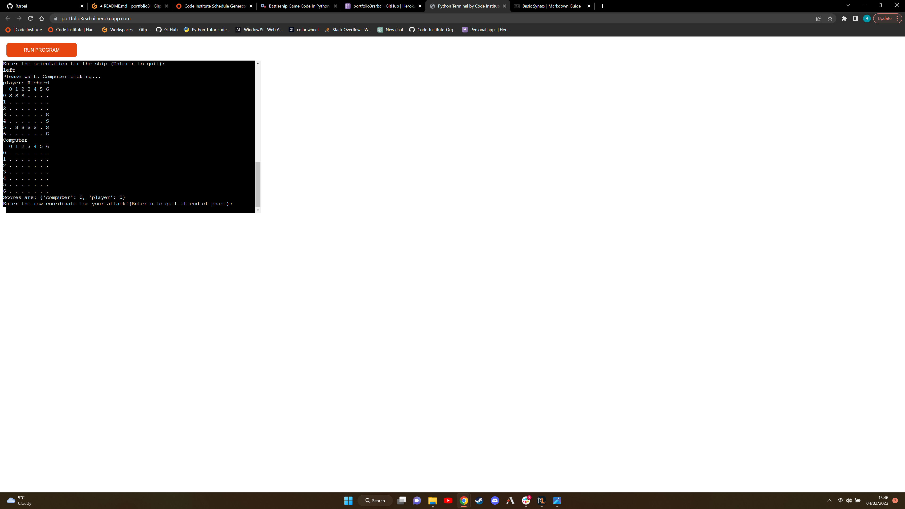

# World Of Battleships

World of Battleships is a game written in Python to be played in the Code Institute
mock terminal on Heroku.

[Here is the live project](https://portfolio3rsrbai.herokuapp.com/)

# Rules of the game

The aim of the game is to have a higher score than the computer
once all attacks have been used up. This means the length of the game is determined by the amount
of attacks set. Enter "n" into any field that requires input except the "name" field to end the game at the end of the 
current phase. The game is fully customizable although the game size is not 
customizable by the player as there are limitations on how big the board game can be inside the heroku 
terminal, so game size is set to 7, please feel free to play a game on a higher board size, this must be 
done through changing the variable size in the new_game function **(Board will be visually deformed on sizes above 10)**, because of limitation to board size I have also capped the number of ships at 3, this is also customizeable.

## Rules

- Player enters a name of their choice
- Both player and computer have separate boards 
- No. of attacks cannot be 0 or negative
- Ships must be between sizes 1 and 4
- Ships cannot be placed off the board or on top of other ships
- After ship placing is done the ships are represented by "S"
- Player and computer then take turns to attack
- Successful attacks are represented by "H", misses are represented by "M" 
- After attacks are depleted scores are calculated and the winner is displayed

# Features

## Existing Features

- Custom Name to be displayed above player board

- Custom number of attacks

- Two boards are printed for player and computer
- Board size, number of ships and number of attacks are displayed
- Information to help user navigate the grid
- Grid key is printed along the left and top of the grid, grid keys adapts to board size
- Prompt to enter ship size

- Enter row 

- Enter column

- Enter orientation

- Ships displayed on player board represented by S
- Scores displayed
- Prompt for row coordinate

- Prompt for column coordinate to attack

- Displays all misses and hits and ships on player board
- Displays all misses and hits on computer board and reveals ship locations
- Displays scores
- Announces the winner or a tie if its a tie

## Future features

- Bigger terminal allowing for bigger game size
- Ship type for example, destroyer, submarine etc.
- A more exciting display for winning the game
- Make the game size customizeable past 10 

# Data model

For a data model I used a Board class. In this game two classes are created one for player_board
and one for computer_board. 

The Board class stores the size of the board, the code to print the board, the number of ships, the 
custom player name, the type of class initialised (player or computer), the number of attacks, the ship positions,
the guesses and the successful hits. 

The methods the Board class includes are a method to place ships, a method to add the ship positions to the final board
of the computer to reveal ship locations to the player, a method to check the computer and player guesses and change the board coordinate to M or H and a method to print the boards and board keys.

# Testing

## Manual testing

- Test number of attacks input

- Test ship size input

- Test ship row input

- Test ship column input

- Test ship orientation input

- Test that ships cannot be placed on top of each other

- Test that ships do not go off grid (or out of bounds)

- Test that ships cannot extend on top of other ships

- Test input of the row for attack

- Test input of the column for attack

- Test that a hit is registered and displayed in scores and on each board

- Test that a miss is registered and displayed on each board

- Test loss result

- Test win result

- Test tie result

## Python Linter

This was a challenge as I did not write my code with restrictions on line length.
I had to change the if statements in player validate input and computer validate input
to not in statement using an array of [up, down, left, right]

## Retest 

After the python linter testing i decided to retest the game, the following screenshot is a test I carried out prompting a response from the code that was changed to pass through the linter.

# Bugs

## Solved bugs

I maticulously tested throughout this project, unexpected bugs werent as common as one might expect. They definatly did happen though.

 - Below is a fix for a bug that i found when deploying my code to heroku, since the heroku terminal wasnt big enough for a size 10 board I had to change the size to 7, though I had not built this functionality in as I lost sight of my goal to have the game be fully customizeable. I also used the enumerate option to generate the key on the left side of the board for a board size up to 10 but this is only functional up to 10 so can be improved in future updates.

   

 - Below we have an instance of a bug that occured throughout my code due to wraping input in int(), this would crash my code if a user entered a word or other non integer value.

 

 - To fix this bug I had to remove the int() from all input instances that required numbers and write the code to validate all types of input data the user could input. An example of this is below:

 

 - Below is a bug that occured due to forgetting to add boolean values to my try/except statements so even when enetered valid data the user would be repeatedly asked for input until manually ending the program.

 

 - This was by far the most challenging bug of all, even with my validation ships were still being placed on top of ships on the computers board so I knew something was wrong with both validations. Here is an example:

 

 - To fix this took me to rewrite the code i think 4-5 times. In the end i realised that I only loop through the direction the ship extends in for one direction. So i wrote code to calculate where the end of the ship would be, and to error if the end is out of bounds. To fix the ships being placed on top of other ships I wrote a for loop checking each grid spot that the ship extends in be that right,left up or down and to error out if a ship is in this spot.

 

 ## Remaining bug

 Game is not currently customizable past size 10, this is due to the numbers offsetting the grid by one space I believe. I have not tackled this bug yet as game is very limited in size to begin with, so any size over 7 I believe would be a bad experience anyway. 7 seemed to be the point where both player and computers board could fit nicely in the terminal allowing space for the viewer to see whats going on around the boards. I do have thoughts on how to to tackle it, I would start by trying an if statement in the for loop that chooses on how much whitespace to have between the number and grid based on the value of i. If i is < 10 then have extra whitespace between the number and grid, essentially moving the whole grid one space right to allow for the extra number past 9. This has not been tested as of yet. I did not want to start rewriting code at this stage of the project for something I believe was not valuable to user experience with the terminal size.

 # Deployment

 I deployed this project on Code Institutes mock terminal on Heroku. 

 Steps for deployment:
 - Fork or clone this repository
 - Create a new Heroku app
 - Set the buildpacks to Python and NoteJS, in that order
 - Link the Heroku app to the repository
 - Click **Deploy**

# Credits

I used the [this website](https://copyassignment.com/battleship-game-code-in-python/) for reference on how a battleship game should look and how some of the functions should look.

I also heavily referenced the portfolio scope video in the Code Institute LMS that gave me the idea of doing a battleship game throughout the project.

I used a terminal for deployment by Code Institute.

